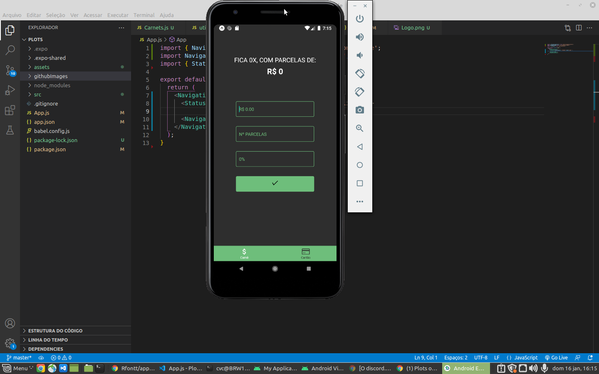
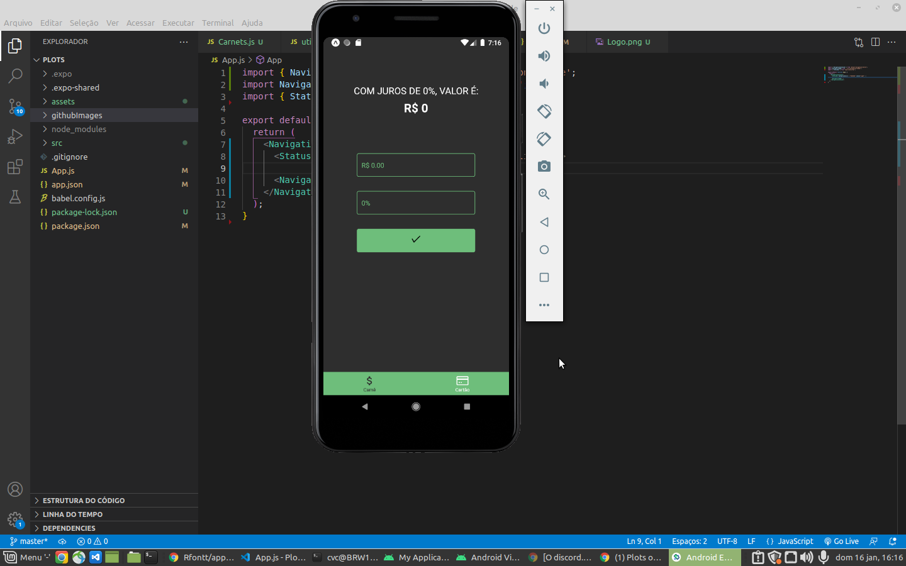

# Sobre o projeto

Esse projeto foi desenvolvido com o fim de fazer a versão mobile do site Plots, a ideia central foi do desenvolvedor Wesley Damasceno(https://github.com/wesleydamasceno), que desenvolveu a versão web dessa aplicação(https://github.com/wesleydamasceno/plots). Eu desenvolvi a versão mobile para fins de aprendizagem sobre react native.

Esse app serve para calcular parcelas de carnê e cartão de crédito. Para saber mais sobre o objetivo do Plots veja a explicação do seu dono sobre ele nesse link: https://github.com/wesleydamasceno/plots

### Imagens do projeto

